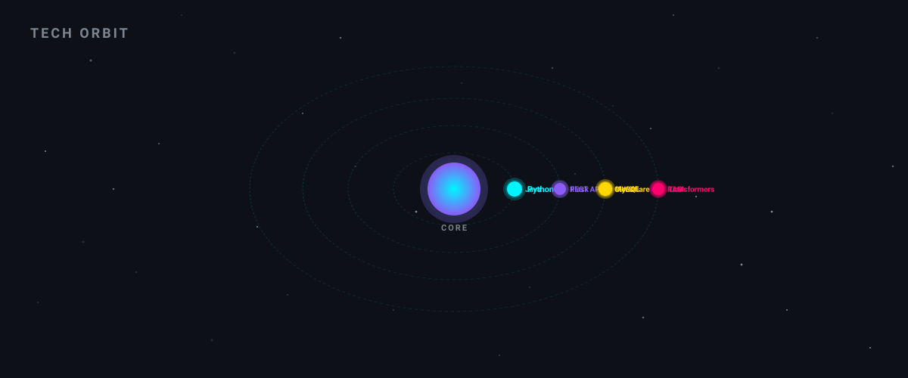
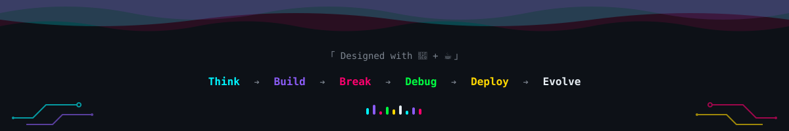

<!-- ═══════════════════════════════════════════════════════════════════════════ -->
<!-- 🌌 CYBERPUNK HOLOGRAPHIC GITHUB PROFILE — ANSH GAUR                       -->
<!-- ═══════════════════════════════════════════════════════════════════════════ -->

<!-- ▓▓▓▓▓▓▓▓▓▓▓▓▓▓▓▓ ANIMATED HEADER SECTION ▓▓▓▓▓▓▓▓▓▓▓▓▓▓▓▓ -->

  
  <!-- Holographic Cyberpunk Header -->
  

  <!-- Profile Views Counter -->
   
  
  &nbsp;
  
  &nbsp;
  

<!-- ▓▓▓▓▓▓▓▓▓▓▓▓▓▓▓▓ TYPING ANIMATION ▓▓▓▓▓▓▓▓▓▓▓▓▓▓▓▓ -->

   
  

 

<!-- ▓▓▓▓▓▓▓▓▓▓▓▓▓▓▓▓ NEURAL NETWORK DIVIDER ▓▓▓▓▓▓▓▓▓▓▓▓▓▓▓▓ -->

<!-- ▓▓▓▓▓▓▓▓▓▓▓▓▓▓▓▓ ANIMATED TERMINAL — ABOUT ME ▓▓▓▓▓▓▓▓▓▓▓▓▓▓▓▓ -->

  <h2>
    
    &nbsp; System.out.println("About Me")
  </h2>

  

 

<!-- ▓▓▓▓▓▓▓▓▓▓▓▓▓▓▓▓ 3D ROTATING CUBE ▓▓▓▓▓▓▓▓▓▓▓▓▓▓▓▓ -->

  <h2>
    🌀 &nbsp; 3D Identity Cube
  </h2>

  

 

<!-- ▓▓▓▓▓▓▓▓▓▓▓▓▓▓▓▓ PAC-MAN GAME DIVIDER ▓▓▓▓▓▓▓▓▓▓▓▓▓▓▓▓ -->

<!-- ▓▓▓▓▓▓▓▓▓▓▓▓▓▓▓▓ TECH RADAR — SKILLS ▓▓▓▓▓▓▓▓▓▓▓▓▓▓▓▓ -->

  <h2>
    
    &nbsp; Tech Radar — Skill Matrix
  </h2>

  

 

<!-- Skill Icons Grid -->

  

 

<!-- Detailed Skill Badges -->

  
  <!-- AI/ML -->
  
  
  
   
  <!-- Languages & Frameworks -->
  
  
  
  
   
  <!-- Cloud & Infra -->
  
  
  
  

 

<!-- ▓▓▓▓▓▓▓▓▓▓▓▓▓▓▓▓ HOLOGRAPHIC SKILL BARS ▓▓▓▓▓▓▓▓▓▓▓▓▓▓▓▓ -->

  <h2>
    📊 &nbsp; Proficiency Matrix
  </h2>

  

 

<!-- ▓▓▓▓▓▓▓▓▓▓▓▓▓▓▓▓ MATRIX CODE RAIN ▓▓▓▓▓▓▓▓▓▓▓▓▓▓▓▓ -->

<!-- ▓▓▓▓▓▓▓▓▓▓▓▓▓▓▓▓ WAVE DIVIDER ▓▓▓▓▓▓▓▓▓▓▓▓▓▓▓▓ -->

<!-- ▓▓▓▓▓▓▓▓▓▓▓▓▓▓▓▓ GITHUB STATS SECTION ▓▓▓▓▓▓▓▓▓▓▓▓▓▓▓▓ -->

  <h2>
    
    &nbsp; GitHub Analytics
  </h2>

  
  &nbsp;&nbsp;
  

 

<!-- Streak Stats -->

  

 

<!-- Activity Graph -->

  

 

<!-- ▓▓▓▓▓▓▓▓▓▓▓▓▓▓▓▓ SOLAR SYSTEM — TECH ORBIT ▓▓▓▓▓▓▓▓▓▓▓▓▓▓▓▓ -->

  <h2>
    🪐 &nbsp; Tech Orbit — Solar System
  </h2>
  

    <em>Technologies orbiting around the core — inner rings = most proficient</em>
  

  

 

<!-- ▓▓▓▓▓▓▓▓▓▓▓▓▓▓▓▓ 3D CONTRIBUTION GRAPH ▓▓▓▓▓▓▓▓▓▓▓▓▓▓▓▓ -->
<!-- This is generated by the GitHub Action in .github/workflows/3d-contrib.yml -->
<!-- After running the action, uncomment the line below and remove the placeholder: -->

  <h2>
    🏙️ &nbsp; 3D Contribution City
  </h2>
  

    <em>Each bar is a day. Taller = more commits. Your code, visualized as a cyberpunk cityscape.</em>
  

  
  <!-- Uncomment after running the GitHub Action (Actions tab → Run workflow): -->
  <!--  -->
  
  <!-- Placeholder until the action generates the graph — delete this after: -->
  

 

<!-- ▓▓▓▓▓▓▓▓▓▓▓▓▓▓▓▓ PAC-MAN GAME DIVIDER ▓▓▓▓▓▓▓▓▓▓▓▓▓▓▓▓ -->

<!-- ▓▓▓▓▓▓▓▓▓▓▓▓▓▓▓▓ EVOLUTION TIMELINE ▓▓▓▓▓▓▓▓▓▓▓▓▓▓▓▓ -->

  <h2>
    ⚡ &nbsp; Evolution Path
  </h2>

  

 

<!-- ▓▓▓▓▓▓▓▓▓▓▓▓▓▓▓▓ 3D GLOBE — LOCATION ▓▓▓▓▓▓▓▓▓▓▓▓▓▓▓▓ -->

  <h2>
    🌍 &nbsp; Location: Earth
  </h2>

  

 

<!-- ▓▓▓▓▓▓▓▓▓▓▓▓▓▓▓▓ TROPHIES ▓▓▓▓▓▓▓▓▓▓▓▓▓▓▓▓ -->

  <h2>
    🏆 &nbsp; Achievement Trophies
  </h2>

  

 

<!-- ▓▓▓▓▓▓▓▓▓▓▓▓▓▓▓▓ CONNECT WITH ME ▓▓▓▓▓▓▓▓▓▓▓▓▓▓▓▓ -->

  <h2>
    🌐 &nbsp; Connect & Collaborate
  </h2>

  <!-- Replace # with your actual links -->
  
  &nbsp;
  
  &nbsp;
  
  &nbsp;
  

 

<!-- ▓▓▓▓▓▓▓▓▓▓▓▓▓▓▓▓ ANIMATED FOOTER ▓▓▓▓▓▓▓▓▓▓▓▓▓▓▓▓ -->

<!-- ▓▓▓▓▓▓▓▓▓▓▓▓▓▓▓▓ SECRET SECTION — EASTER EGG ▓▓▓▓▓▓▓▓▓▓▓▓▓▓▓▓ -->

<!--
 ╔══════════════════════════════════════════════════════════════════╗
 ║  🎮 You found the hidden source code!                          ║
 ║  If you're reading this, you're probably a developer too.       ║
 ║  Star this repo if you liked the design! ⭐                    ║
 ║                                                                 ║
 ║  Built with: Custom SVG animations + CSS @keyframes             ║
 ║  Theme: Cyberpunk Holographic Interface                         ║
 ║  No JavaScript. Pure SVG sorcery. 🧙                            ║
 ╚══════════════════════════════════════════════════════════════════╝
-->
